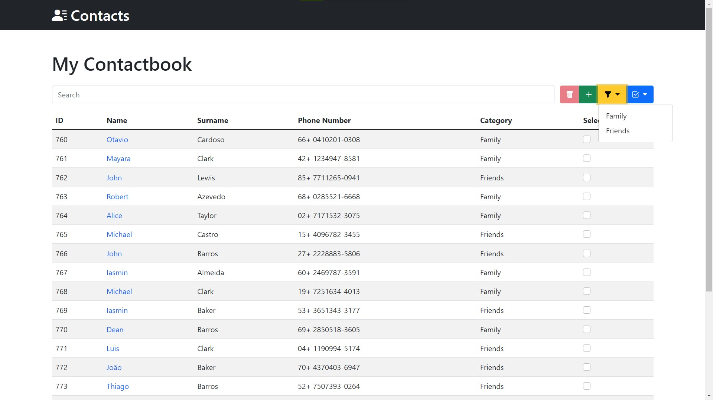

# Schedule
A Contacts Book Web Application implemented in Django.

## Features
- Add new contacts;
- Select and delete contacts;
- Visualize and edit contacts;

## Installing and running
- Clone this repository with `https://github.com/William-Fernandes252/Schedule.git`;
- Inside of `/Schedule` run `python manage.py runserver`;
- Finally, go to [http://127.0.0.1:8000](http://127.0.0.1:8000) in your browser.

## Project snapshot

<h3 align="center">Contact page</h3>

<h3 align="center">Add contact</h3>

<h3 align="center">Edit contact</h3>

